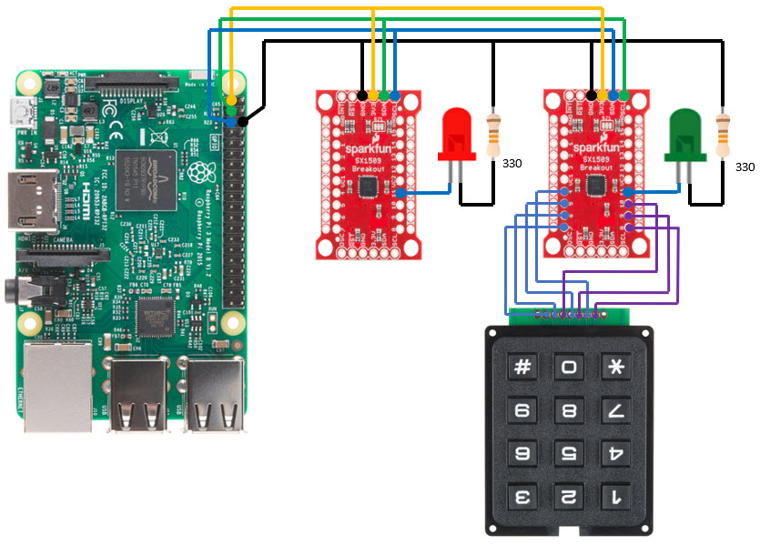

# Adding an I/O Expander to the Pi

The SparkFun Breakout for SX1509:<br>
https://www.sparkfun.com/products/13601

SparkFun's tutorial:<br>
https://learn.sparkfun.com/tutorials/sx1509-io-expander-breakout-hookup-guide

Datasheet for the SX1509:<br>
https://cdn.sparkfun.com/assets/learn_tutorials/4/3/4/sx150x_789.pdf

Keypad from Adafruit:<br>
https://www.adafruit.com/product/3845


## Schematics



## i2C

The boards have solder-pad jumpers for configuring the I2C addresses. I left one
of the boards alone at 00 for the address 0x3E. On the other board I cut the
ADD0 trace to 0 and soldered it to 1. That's 01 for the address 0x3F.

```
pi@tink:~ $ i2cdetect -y 1
     0  1  2  3  4  5  6  7  8  9  a  b  c  d  e  f
00:          -- -- -- -- -- -- -- -- -- -- -- -- -- 
10: -- -- -- -- -- -- -- -- -- -- -- -- -- -- -- -- 
20: -- -- -- -- -- -- -- -- -- -- -- -- -- -- -- -- 
30: -- -- -- -- -- -- -- -- -- -- -- -- -- -- 3e 3f 
40: -- -- -- -- -- -- -- -- -- -- -- -- -- -- -- -- 
50: -- -- -- -- -- -- -- -- -- -- -- -- -- -- -- -- 
60: -- -- -- -- -- -- -- -- -- -- -- -- -- -- -- -- 
70: -- -- -- -- -- -- -- --                         
``` 

## Testing


